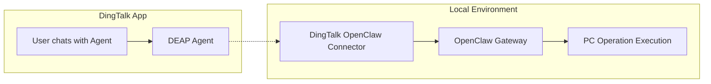

# DingTalk DEAP Agent Integration

> [中文版](DEAP_AGENT_GUIDE.md)

Connect DingTalk [DEAP](https://deap.dingtalk.com) Agent with [OpenClaw](https://openclaw.ai) Gateway to enable natural language-driven local device operations.

## Key Features

- ✅ **Natural Language Interaction** - Users type natural language commands in the DingTalk chat (e.g., "Find PDF files on my desktop"), and the Agent automatically parses and executes the corresponding operations
- ✅ **NAT Traversal** - Designed for local devices without public IPs, establishing a stable communication tunnel between local and cloud environments via the Connector client
- ✅ **Cross-Platform Support** - Provides native binaries for Windows, macOS, and Linux, ensuring smooth operation across all platforms

## System Architecture

This solution uses a layered architecture with three core components:

1. **OpenClaw Gateway** - Deployed on the local device, provides a standardized HTTP interface for receiving and processing operation commands from the cloud, leveraging the OpenClaw engine to execute tasks
2. **DingTalk OpenClaw Connector** - Runs locally, building a communication tunnel between local and cloud environments to solve the problem of local devices without public IPs
3. **DingTalk DEAP MCP** - An extension module for the DEAP Agent, responsible for forwarding user natural language requests to the OpenClaw Gateway via the cloud tunnel



## Implementation Guide

### Step 1: Set Up the Local Environment

Ensure the OpenClaw Gateway is installed and running on your local device. The default address is `127.0.0.1:18789`:

```bash
openclaw gateway start
```

#### Configure Gateway Parameters

1. Visit the [Configuration Page](http://127.0.0.1:18789/config)
2. In the **Overview**, set the Gateway Token and save it securely:
   
3. Switch to **Infrastructure** and enable the `OpenAI Chat Completions Endpoint`:
   

4. Click the `Save` button in the top-right corner to save your configuration

### Step 2: Obtain Required Parameters

#### Get corpId

Log in to the [DingTalk Developer Platform](https://open-dev.dingtalk.com) to find your enterprise CorpId:


#### Get apiKey

Log in to the [DingTalk DEAP Platform](https://deap.dingtalk.com), navigate to **Security & Permissions** → **API-Key Management** to create a new API Key:


### Step 3: Start the Connector Client

1. Download the installer for your operating system from the [Releases](https://github.com/hoskii/dingtalk-openclaw-connector/releases/tag/v0.0.1) page
2. Extract and run the Connector in the corresponding directory (macOS example):

   ```bash
   unzip connector-mac.zip
   ./connector-darwin -deapCorpId YOUR_CORP_ID -deapApiKey YOUR_API_KEY
   ```
   

### Step 4: Configure the DEAP Agent

1. Log in to the [DingTalk DEAP Platform](https://deap.dingtalk.com) and create a new agent:

   

2. In the skill management page, search for and integrate the OpenClaw skill:

   

3. Configure skill parameters:

   | Parameter    | Source     | Description                                                                            |
   | ------------ | ---------- | -------------------------------------------------------------------------------------- |
   | apikey       | From Step 2 | DEAP Platform API Key                                                                  |
   | apihost      | Default     | Typically `127.0.0.1:18789`. On Windows, you may need to use `localhost:18789` instead |
   | gatewayToken | From Step 1 | Gateway authentication token                                                           |

   

Note that OpenClaw is an MCP, so you also need to configure its trigger rules. The MCP will only be invoked when the rules are satisfied:


4. Publish the Agent:

   

### Step 5: Start Using

1. Search for and find your Agent in the DingTalk App:

   

2. Start your natural language conversation:

   
