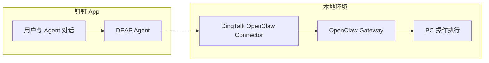
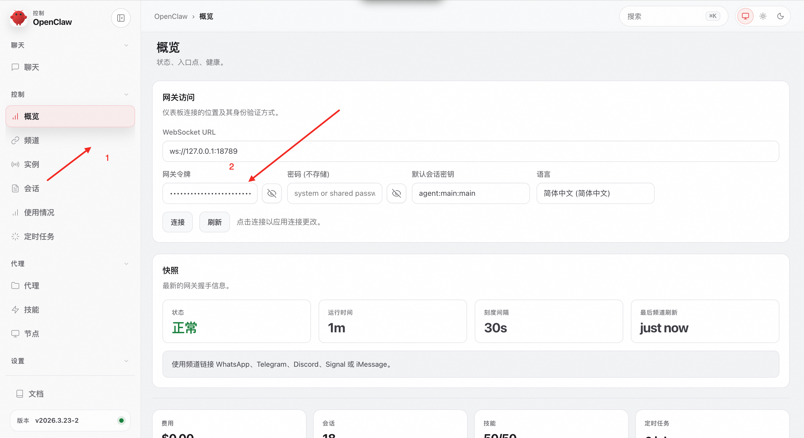
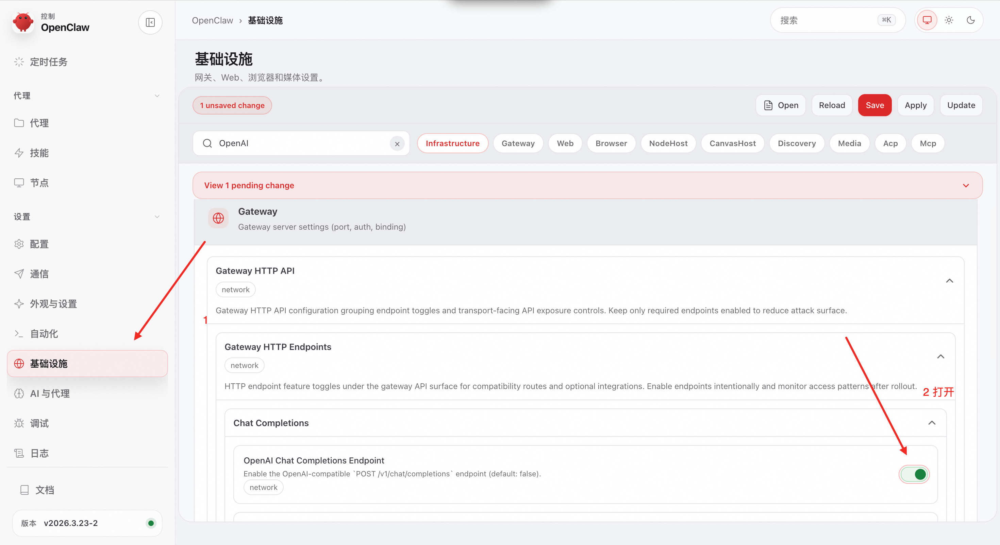
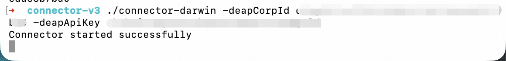

# 钉钉 DEAP Agent 集成

> [English Version](DEAP_AGENT_GUIDE.en.md)

通过将钉钉 [DEAP](https://deap.dingtalk.com) Agent 与 [OpenClaw](https://openclaw.ai) Gateway 连接，实现自然语言驱动的本地设备操作能力。

## 核心功能

- ✅ **自然语言交互** - 用户在钉钉对话框中输入自然语言指令（如"帮我查找桌面上的 PDF 文件"），Agent 将自动解析并执行相应操作
- ✅ **内网穿透机制** - 专为本地设备无公网 IP 场景设计，通过 Connector 客户端建立稳定的内外网通信隧道
- ✅ **跨平台兼容** - 提供 Windows、macOS 和 Linux 系统的原生二进制执行文件，确保各平台下的顺畅运行

## 系统架构

该方案采用分层架构模式，包含三个核心组件：

1. **OpenClaw Gateway** - 部署于本地设备，提供标准化 HTTP 接口，负责接收并处理来自云端的操作指令，调动 OpenClaw 引擎执行具体任务
2. **DingTalk OpenClaw Connector** - 运行于本地环境，构建本地与云端的通信隧道，解决内网设备无公网 IP 的问题
3. **DingTalk DEAP MCP** - 作为 DEAP Agent 的扩展能力模块，负责将用户自然语言请求经由云端隧道转发至 OpenClaw Gateway



## 实施指南

### 第一步：部署本地环境

确认本地设备已成功安装并启动 OpenClaw Gateway，默认监听地址为 `127.0.0.1:18789`：

```bash
openclaw gateway start
```

#### 配置 Gateway 参数

1. 访问 [配置页面](http://127.0.0.1:18789/config)
2. 在 **概览** 中设置 Gateway Token 并妥善保存：
   
3. 切换至 **基础设施**，启用 `OpenAI Chat Completions Endpoint` 功能：
   

4. 点击右上角 `Save` 按钮完成配置保存

### 第二步：获取必要参数

#### 获取 corpId

登录 [钉钉开发者平台](https://open-dev.dingtalk.com) 查看企业 CorpId：


#### 获取 apiKey

登录 [钉钉 DEAP 平台](https://deap.dingtalk.com)，在 **安全与权限** → **API-Key 管理** 页面创建新的 API Key：


### 第三步：启动 Connector 客户端

1. 从 [Releases](https://github.com/hoskii/dingtalk-openclaw-connector/releases/tag/v0.0.1) 页面下载适配您操作系统的安装包
2. 解压后在对应目录运行 Connector（以 macOS 为例）：

   ```bash
   unzip connector-mac.zip
   ./connector-darwin -deapCorpId YOUR_CORP_ID -deapApiKey YOUR_API_KEY
   ```
   

### 第四步：配置 DEAP Agent

1. 登录 [钉钉 DEAP 平台](https://deap.dingtalk.com)，创建新的智能体：

   

2. 在技能管理页面，搜索并集成 OpenClaw 技能：

   

3. 配置技能参数：

   | 参数         | 来源       | 说明                                                                                   |
   | ------------ | ---------- | -------------------------------------------------------------------------------------- |
   | apikey       | 第二步获取 | DEAP 平台 API Key                                                                      |
   | apihost      | 默认值     | 通常为 `127.0.0.1:18789`，在Windows环境下可能需要配置为 `localhost:18789` 才能正常工作 |
   | gatewayToken | 第一步获取 | Gateway 配置的认证令牌                                                                 |

   

注意 OpenClaw 属于一个MCP，还需要配置他的触发规则，满足规则的情况下才会使用这个MCP:


4. 发布 Agent：

   

### 第五步：开始使用

1. 在钉钉 App 中搜索并找到您创建的 Agent：

   

2. 开始自然语言对话体验：

   
